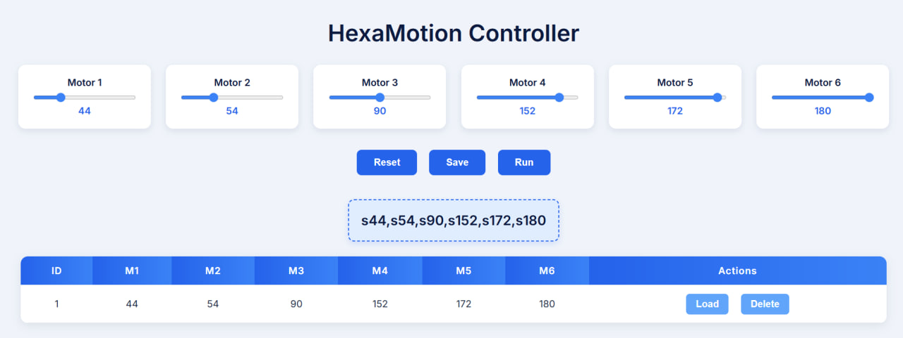

# 💻 HexaMotion Control Panel
HexaMotion is a web-based control panel designed to manipulate a robotic arm with six degrees of freedom (6 DOF). The interface allows users to adjust servo motor angles using intuitive sliders, then perform key actions like saving a pose, resetting values, or running the robotic movement. Each saved pose is stored in a MySQL database and displayed in a dynamic table, where users can easily load or delete individual entries. This project combines HTML, CSS, JavaScript, PHP, and MySQL to provide real-time interaction and data management, making it an ideal tool for robotic motion testing and automation tasks..

# 🖼️ Preview

# 📌 Project Overview

HexaMotion enables real-time control of six servo motors with the following features:
- Interactive sliders to set each motor's angle.
- Run the robotic arm with current settings.
- Save current motor positions to the database.
- View a table of saved motor configurations.
- Load or delete individual configurations from the table.

# 📂 File Structure

| File                  | Description                              |
|-----------------------|----------------------------------------|
| db.php              | Handles database connection             |
| delete_motor_data.php | Deletes a saved motor configuration    |
| get_motor_data.php   | Fetches all saved motor data            |
| run_pose.php         | Runs the current motor positions        |
| update_motor_data.php | Saves or updates motor positions in DB |
| index.html          | Main control panel interface             |
| script.js           | JavaScript logic for interaction         |
| style.css           | Page styling and design                  |

#  🗃️ Database Structure

- Database Name: prog_task3  
- Table Name: motor_data  
- Fields:
  - id (INT, AUTO_INCREMENT, PRIMARY KEY)
  - s1 to s6 (INT): Motor position values
  - created_at (TIMESTAMP): Timestamp of saving

## ⚙️How to Use
 1. Open the project in a local PHP environment (like XAMPP).
 2. Use the sliders to set each motor’s angle.
 3. Click:
 • Run: to execute the current pose.
 • Save: to store the pose in the database.
 • Reset: to reset all values to 0.
 4. At the bottom of the interface, a table displays all saved poses with:
 • A Load button to apply a saved pose.
 • A Delete button to remove a pose.
